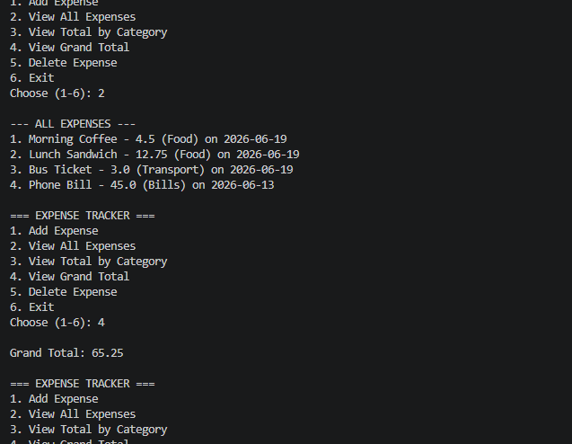

markdown
# Expense Tracker (Java + SQLite)

Expense tracker with database persistence using SQLite.

## Features
- Add/view/delete expenses
- Category totals
- Grand total
- Persistent SQLite database

## How to run
```bash
## Setup
1. Download sqlite-jdbc-3.47.0.0.jar from https://github.com/xerial/sqlite-jdbc/releases
2. Place it in the `lib/` folder
3. Compile: `javac -cp ".;lib/sqlite-jdbc-3.47.0.0.jar" *.java`
4. Run: `java -cp ".;lib/sqlite-jdbc-3.47.0.0.jar" Main`
```

## Sample Output
<p align="center">
  
</p>
